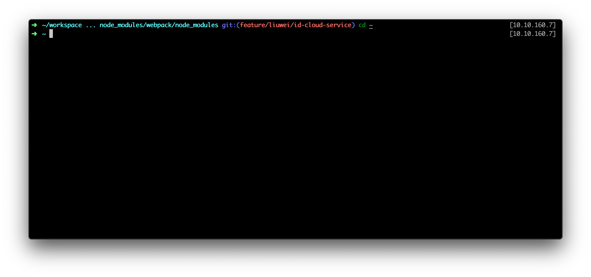

# neewbee.zsh-theme

based on [robbyrussell](https://github.com/robbyrussell/oh-my-zsh/wiki/Themes#robbyrussell).

1. Show full path unless it's too long.
2. Show ip address. It's covenient when you login to multiple server.

### HOW TO

1. Copy `neewbee.zsh-theme` to  ~/.oh-my-zsh/theme
2. Change your `~/.zshrc` file, change `ZSH_THEME` to `neewbee`
3. `source ~/.zshrc`

### Note

You can define `NEEWBEE_ZSH_THEME_IP_INTERFACE` variable to you network interface name (etn0, wol0, etc),

or it will show the first none-empty value, which may not be what you want.

### Screenshot

